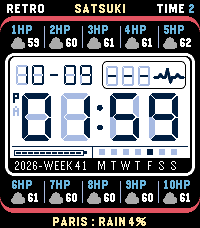
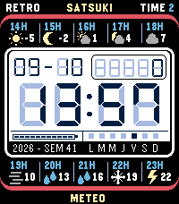
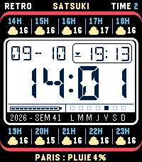
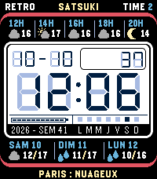
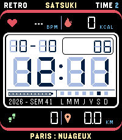
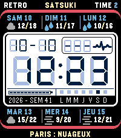
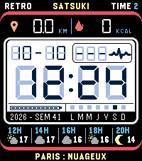

# Satsuki Retro LCD Meteo

A retro digital LCD-inspired watchface designed for the Pebble Time 2.

Satsuki Retro LCD Meteo combines a highly readable digital clock with weather information and several configurable complications in a colorful retro LCD interface.

Get it here : https://apps.repebble.com/0deee14e32e54453a975067f

## Inspiration and project origins

The design of Satsuki Retro LCD Meteo is notably inspired by **Quartz by Dalpek**, a retro LCD watchface for the Pebble Time 2: https://apps.repebble.com/quartz-by-dalpek_31cfe29ecd814df4b5ca8bb4

The project also uses the **casioc** project by sgitaize as a starting point for its codebase: https://github.com/sgitaize/casiocgm

The original code has been **extensively reviewed, adapted and modified** to create Satsuki Retro LCD Meteo, including the addition of weather information, hourly forecasts, color weather icons, configurable complications, bilingual settings and other features specific to this watchface.

Many thanks to the authors of the projects that provided inspiration and a technical starting point for this project.

## Features

• 24-hour or 12-hour time with A/P indicator 
• Multiple segments font available (7 and 14 segments) 
• DD-MM or MM-DD date format 
• Day of the week in French or English 
• Hourly weather forecast for the next 5/10 periods (period of 1h, 2h, 3h, 4h) or 3/6 days forecast 
• Retro weather icons in monochrome or color 
• Temperature in °C or °F 
• Current city name and daily weather trend 
• Sunrise and sunset information 
• Distance unit selectable between kilometers and miles 
• Ghost LCD segments for an authentic digital-display look 
• French and English interface 
• Color palette designed for the Pebble Time 2 color display 

• Configurable complication (center):
* steps
* heart rate
* distance walked
* next sunrise or sunset
* seconds
* battery % (monochrome or color)

• Configurable complication (top/bottom):
* steps
* heart rate
* distance walked
* next sunrise or sunset
* calories
* weather (periods 1h,2h,3h,4h or 3 days)

## Weather

Weather data is retrieved from Open-Meteo through the connected phone.

The watchface uses the phone's location to determine the current city and retrieve the corresponding weather forecast.

Weather information is refreshed regularly while the watchface communicates with the phone.

## Configuration

The main options are available from the watchface settings page in the Pebble app:
• language 
• Segment font 
• Ghosting type 
• date format 
• 12-hour / 24-hour time 
• weather icon style 
• complications (top, center, bottom) 
• distance unit 
• temperature unit 

## Compatibility

Designed primarily for the Pebble Time 2 (Emery).

The layout and graphics are optimized for its 200 × 228 color display.

## Credits

Design and development: Satsuki Retro LCD Meteo.

Inspired in part by **Quartz by Dalpek**.

Codebase: **casioc by sgitaize**, extensively reviewed, adapted and modified for this project.

Fonts: [DSEG](https://github.com/keshikan/DSEG) de keshikan, sous licence SIL Open Font License 1.1 (`resources/fonts/DSEG-LICENSE.txt`).

Weather : [Open-Meteo](https://open-meteo.com).

This is an independent project and is not affiliated with Dalpek, sgitaize, Casio, Seiko, Timex or any other watch manufacturer.

© 2026 — Satsuki Retro LCD Meteo

---------------------------------------------------------------------------------
---------------------------------------------------------------------------------

# Satsuki Retro LCD Meteo

Une watchface rétro inspirée des écrans LCD des montres numériques classiques, conçue pour la Pebble Time 2.

Satsuki Retro LCD Meteo combine une horloge numérique très lisible, des informations météo et plusieurs complications configurables dans une interface LCD rétro colorée.

Disponible ici : https://apps.repebble.com/0deee14e32e54453a975067f

## Inspiration et origine du projet

Le design de Satsuki Retro LCD Meteo est notamment inspiré de **Quartz by Dalpek**, une watchface rétro LCD pour Pebble Time 2 : https://apps.repebble.com/quartz-by-dalpek_31cfe29ecd814df4b5ca8bb4

Le projet utilise également comme point de départ le code du projet **casioc** de sgitaize : https://github.com/sgitaize/casiocgm

Le code d'origine a été **entièrement revu, adapté et largement modifié** pour créer Satsuki Retro LCD Meteo, notamment afin d'intégrer la météo, les prévisions horaires, les icônes météo en couleurs, les complications, la configuration bilingue et les fonctionnalités spécifiques à cette watchface.

Un grand merci aux auteurs des projets qui ont servi d'inspiration et de base technique.

## Fonctionnalités

• Heure au format 24 h ou 12 h avec indicateur A/P 
• Plusieurs police pour les segments (en 7 et 14 segments) 
• Intensité du ghosting 
• Date au format JJ-MM ou MM-JJ 
• Jour de la semaine en français ou en anglais 
• Prévisions météo heure par heure pour les 5/10 prochaines périodes par pas de 1h, 2h, 3h, 4h ou prévsionnel sur 3/6 jours. 
• Icônes météo rétro en monochrome ou en couleurs 
• Température en °C ou °F 
• Nom de la ville et tendance météo du jour 
• Lever et coucher du soleil 
• Unité de distance configurable en kilomètres ou miles 
• Segments LCD fantômes pour renforcer l'aspect écran numérique rétro 
• Interface française et anglaise 
• Couleurs et éléments graphiques pensés pour l'écran couleur de la Pebble Time 2

• Complication configurable (centre) :
* nombre de pas
* fréquence cardiaque
* distance parcourue
* prochain lever ou coucher du soleil
* secondes
* batterie en % (monochrome ou couleur)

• Complication configurable (haut/bas) :
* nombre de pas
* fréquence cardiaque
* distance parcourue
* prochain lever ou coucher du soleil
* calories
* météo

## Météo

Les données météo sont récupérées depuis Open-Meteo via le téléphone.

La watchface utilise la position du téléphone pour déterminer la localisation et afficher le nom de la ville ainsi que les prévisions correspondantes.

Les prévisions sont actualisées régulièrement lorsque la watchface communique avec le téléphone.

## Configuration

Les principaux réglages sont accessibles depuis la page de configuration de la watchface dans l'application Pebble :

• langue 
• police 
• niveau de ghosting 
• format de date 
• format 12 h / 24 h 
• style des icônes météo 
• complication 
• unité de distance 
• unité de température 

## Compatibilité

Conçue principalement pour la Pebble Time 2 (Emery).

L'apparence et les fonctions sont optimisées pour son écran couleur 200 × 228 pixels.

## Crédits

Design et développement : Satsuki Retro LCD Meteo.

Projet inspiré notamment par **Quartz by Dalpek**.

Base de code : **casioc de sgitaize**, entièrement revue, adaptée et modifiée pour ce projet.

Polices: [DSEG](https://github.com/keshikan/DSEG) de keshikan, sous licence SIL Open Font License 1.1 (`resources/fonts/DSEG-LICENSE.txt`).

Météo : [Open-Meteo](https://open-meteo.com).

Ce projet est indépendant et n'est pas affilié à Dalpek, sgitaize, Casio, Seiko, Timex ou à tout autre fabricant de montres.

© 2026 — Satsuki Retro LCD Meteo
